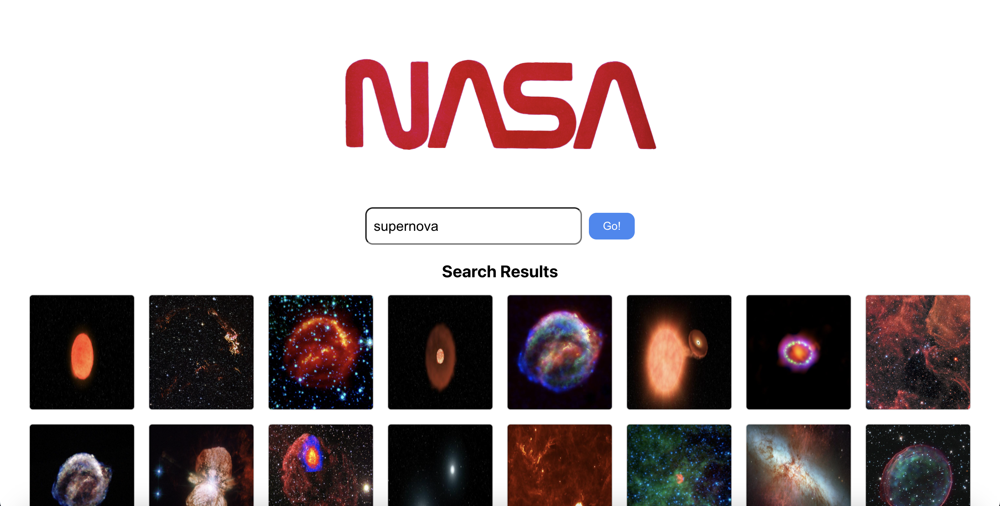
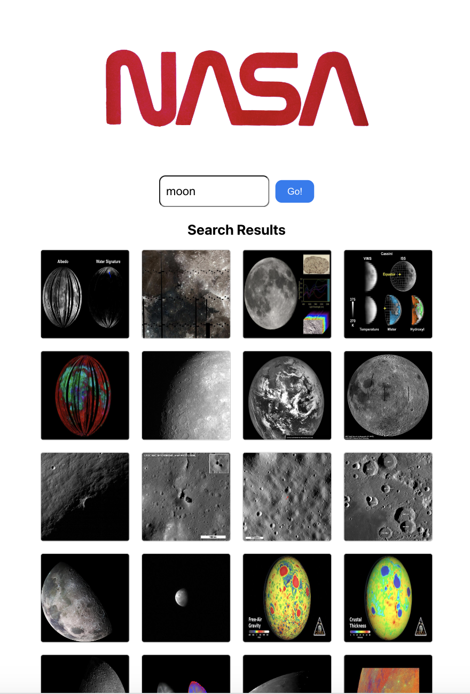

# Technical Test: Search App

## Description

In this technical test, I was asked to create a search app using React. The app allows users to enter a search query, retrieves images from the NASA Images API based on the search query, and displays the search results.

Screenshots
Desktop View

Mobile View

### Technologies Used

React: A JavaScript library for building user interfaces.

Jest: A JavaScript testing framework for writing test cases.

React Testing Library: A testing utility for testing React components.

Axios: A promise-based HTTP client for making API requests.

### Getting Started

To run the app locally, follow these steps:

Clone the repository:

Copy code

<pre><code>
git clone https://github.com/your-username/your-repo.git </code></pre>

Navigate to the project directory:

<pre><code>
cd your-repo
</code></pre>

Install the dependencies:

<pre><code>
npm install
</code></pre>

Start the development server:

<pre><code>
npm start
</code></pre>

Open your browser and visit http://localhost:3000 to view the app.

### Future Improvements

Given more time, I would consider implementing the following additions to the app:

Pagination: Allow users to navigate through multiple pages of search results.

Error handling: Display meaningful error messages when API requests fail.

Load more button: Provide an option to load additional search results.

Refactoring: Improve code structure, separate components, and enhance overall code organization.

Unit tests: Write comprehensive unit tests to cover all components and functions.

### Author

Author: Benj Speight

Feel free to reach out if you have any questions or need further assistance.

Happy searching!
